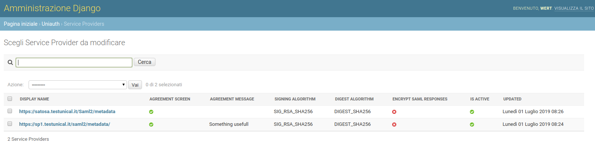

# Django uniAuth


**Django Unified Authentication System** is an *IDentity Provider* built on top of [IdentityPython](https://idpy.org) stack.
It was born as a fork of [djangosaml2idp](https://github.com/OTA-Insight/djangosaml2idp/) project of which very little has by now remained.

Consult the [Official Documentation at readthedocs](https://uniauth.readthedocs.io/en/latest/index.html) for usage specifications and advanced topics.


This Release implements a SAML2 IDP.

An OIDC Provider on top of [IdentityPython](https://idpy.org) will be also available in the next releases.

## SAML2 Features

uniAuth, as a SAML2 IDP, is based on [pysaml2](https://github.com/IdentityPython/pysaml2) and it supports:

- HTTP-REDIRECT and POST bindings;
- AuthnRequest with or without ForceAuthn;
- SLO, SAML Single Logout;
- Encrypted assertions, customizable sign/digest algorithms and, in general, a good posture in terms of security and data integrity regarding SAML standards;
- AllowCreate, nameid is stored if nameid format is persistent.

## Implementation specific Features

- Full Internazionalization support (i18n);
- Interactive Metadata Store definitions through the Admin Backend UI;
- Interactive ServiceProvider Federation through the Admin Backend UI;
- Customizable Template and style based on [AGID guidelines](https://www.agid.gov.it/it/argomenti/linee-guida-design-pa);
- MetadataStore and SP validations on save, to prevent faulty configurations in production environment;
- Optional and quite granular Agreement Screen;
- Configurable digest algorithm and salt for Computed NameID;
- Many configurable options, for every SP we can decide:
    - signature and digest algorithms;
    - attributes release policies;
    - attribute rewrite and creation, fully configurable AttributeProcessors per SP, every aspect of attribute release can be customized from schratch;
    - agreement screen message, availability, data consent form.
- Configurable log rotation through uwsgi;
- Importable StoredPersistentID for each user, from migrations from another IDP;
- An optional LDAP web manager with a configurable app (`ldap_peoples`);
- Multiple LDAP sources though `pyMultiLDAP <https://github.com/peppelinux/pyMultiLDAP>`__;
- Multifactor support, as originally available in djangosaml2idp;
- Detailed logs.


## Characteristics

uniauth will let us to configure metadata stores and federate new Service Providers directly from the Admin backend interface, via Web.
See [Official Documentation at readthedocs](https://uniauth.readthedocs.io/en/latest/index.html) for usage specifications and advanced topics.

---


*Every Metadata store, during creation or update, will be validated to avoid faulty configurations in production environment*

---



*To federate a new SP is just needed to have its entityID in some of the metadata handled by a metadata store. All the other options and informations regards security, agreement, data consent policy and Attribute releases will be managed through Attribute Processors.*

## Contribute

Feel free to contribute creating separate PR from dedicated branches for each feature.
Open an Issue if you want to talk before develop to reduce the risk to be unmerged for some latest reason.

## Tests

````
pip install -r requirements-dev.txt
pytest tests/ -x --pdb
````

## Troubleshooting

````
AttributeError: module 'enum' has no attribute 'IntFlag'

pip uninstall -y enum34
```
