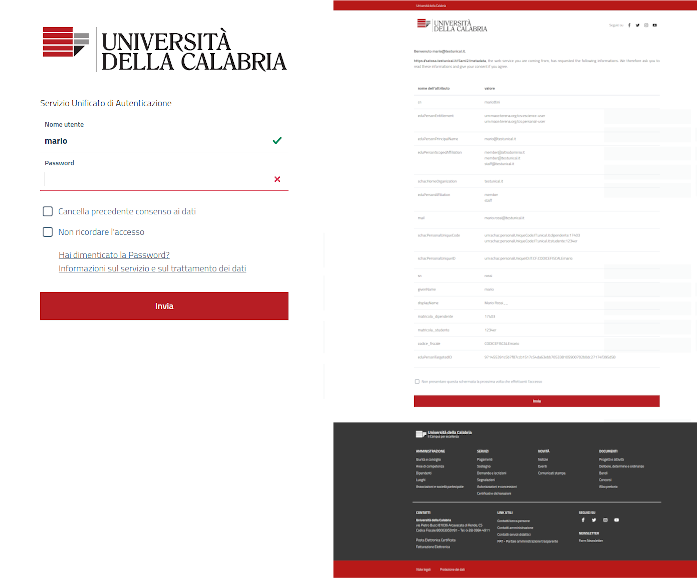

# Django uniAuth


**uniauth-saml2-idp** is an SAML2 *IDentity Provider* built on top of [Pysaml2](https://idpy.org) and Django.
It was born as a fork of [djangosaml2idp](https://github.com/OTA-Insight/djangosaml2idp/) project of which very little has by now remained.

Consult the [Official Documentation at readthedocs](https://uniauth.readthedocs.io/) for usage specifications and advanced topics.



## SAML2 Features

- HTTP-REDIRECT and POST bindings;
- ForceAuthn;
- SAML Single Logout;
- Signed and Encrypted assertions;
- AllowCreate, nameid is stored with a persistent nameid format.

## Implementation specific Features

- no restart is needed when add a new metadata or Service Provider Definition;
- Full Internazionalization support (i18n);
- Interactive Metadata Store definitions through the Admin Backend UI;
- Interactive ServiceProvider definition through the Admin Backend UI;
- Customizable Template and style based on [AGID guidelines](https://www.agid.gov.it/it/argomenti/linee-guida-design-pa);
- MetadataStore and SP validations on save, to prevent faulty configurations in production environment;
- Configurable digest algorithm and salt for Computed NameID;
- Many configurable options, for every SP we can decide:
    - enable/disable explicitally;
    - signature and digest algorithms;
    - attributes release (force a set or release what requested by sp);
    - attribute rewrite and creation, fully configurable AttributeProcessors per SP, every aspect of attribute release can be customized from scratch;
    - agreement screen message, availability, data consent form.
- Configurable log rotation through uwsgi and python logging;
- Importable StoredPersistentID for each user, from migrations from another IDP;
- An optional LDAP web manager with a configurable app (`ldap_peoples`) through [django-ldap-academia-ou-manager](https://github.com/peppelinux/django-ldap-academia-ou-manager);
- _Multiple LDAP_ sources through [pyMultiLDAP](https://github.com/peppelinux/pyMultiLDAP);
- _aacli_ and _mdquery_ management command (yes, inspired by Shibboleth IdP);
- Detailed logs.


## Examples

uniAuth permit to add new metadata and register new Service Providers directly from the Admin backend interface, via Web.
See [Official Documentation at readthedocs](https://uniauth.readthedocs.io/) for usage specifications and advanced topics.

---


*Every Metadata store, during creation or update, will be validated to avoid faulty configurations in production environment.*

---


*Create a new SP. If `SAML_DISALLOW_UNDEFINED_SP` is True this configuration is mandatory, otherwise only the sp metadata is needed, the SP configuration will be created automatically using a default configuration.*

## Docker compose

````
sudo apt install jq docker-compose
````

Do your customization in the project folder example-docker
````
cp -R example example-docker
````

Start the compose
````
cd compose
sudo bash run-docker-compose.sh
````

Volumes
````
uniauth_proj         ../example-docker/

uniauth_nginx_certs  ./nginx/certs/
uniauth_nginx_static ../example-docker/static/
````

## OSX installation

Virtualenv and Debugger

````
pip3 install virtualenv
````

Create and activate environment

````
virtualenv env
. env/bin/activate
````

Install dependencies

````
pip3 install -e .
pip3 install -r requirements-dev.txt
pip3 install -r requirements-customizations.txt
````

Install XMLSec1 [issue](https://github.com/IdentityPython/pysaml2/issues/906), edit saml in the virtualenv to fix incorrect signature

````
brew install libxmlsec1
````

Install urlib older version [issue](https://github.com/invoke-ai/InvokeAI/issues/3358), because the newer version conflicts with the older version of ssl

````
pip3 install urllib3==1.26.6
````

## Run the example project locally
````
cd example
./manage.py migrate
./manage.py createsuperuser
./manage.py runserver 0.0.0.0:9000
`````

## Tests

````
pip install -r requirements-dev.txt
pytest tests/ -x --pdb
````

code coverage
````
coverage erase
coverage run -m pytest tests/
coverage report -m
````

A test LDAP server is available in `tests/ldapd.py`.
You can run it manually and test a query with `ldapsearch`.
Unit test will run `ldapd.py` automatically.

```
python3 tests/ldapd.py

ldapsearch -H ldap://localhost:3899 -b "dc=testunical,dc=it" -x uid=mario

# auth bind
ldapsearch -H ldap://localhost:3899 -b "dc=testunical,dc=it" uid=mario -D "uid=mario,ou=people,dc=testunical,dc=it" -w cimpa12
```

## Contribute

Feel free to contribute creating separate PR from dedicated branches for each feature.
Please open an Issue if you want to talk before develop, to reduce the risk to be not merged for some reason.
