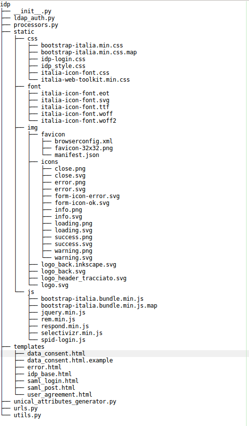

Customize uniAuth
^^^^^^^^^^^^^^^^^

In the projects tree there's an example project called `example`.
It come with an application callend `uniauth_unical_template` in ``django_idp.settingslocal.INSTALLED_APPS`` where we have all the html template and static files. Start from this example template for doing your customizations.

  This is the structure of `idp`

Localization i18n
^^^^^^^^^^^^^^^^^

It relies to `Django documentation <https://docs.djangoproject.com/en/2.2/ref/django-admin/#django-admin-makemessages>`__.

You'll find gettext .po files into ``locale/`` folder, then you can translate messages before compiling them with:

::

    ./manage.py compilemessage
