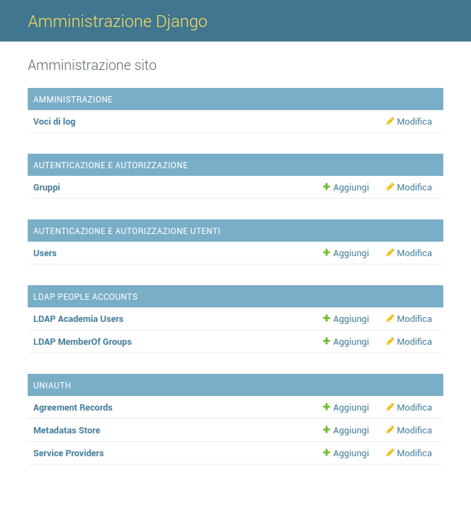

Why I decided to develop this IDP
^^^^^^^^^^^^^^^^^^^^^^^^^^^^^^^^^

Many SAML2 IDP OpenSource softwares come as mature, I used them and also appreciate them.
As a long date Python Programmer I was also looking for something more smart for my needs, at the same time it should have been also very compliant to the standards. For these reasons I choosed to start development on top of Django Framework and pySAML2.

I also noticied that there come always the need to have high sysadmin skills to work with SAML integrated systems, data definitions still need to be
stored and handled in multiple files and in a way that, I think, there's too much management costs in time, with repetitive and boring actions handled via console. In addition to this the learning curve related to SAML2 implementations proves itself very slow, often many users preferred to get out of all this.

I also found a lot of python projects developed from scratch and I thought that a Django implementation of them would be a better solution. I decided then to develop an application that would let simple users to do an applicative administration of the platform, create new metadata store and federate new Service Provider, without handle high sysadmin tasks.

Why these great softwares still doesn't have a human management UI and other helpers tools was therefore another of my important questions.

  Admin backend preview, a daily IDP administration will give you everything you need without touching the console.

I made contributions in `djangosaml2idp <https://github.com/OTA-Insight/djangosaml2idp>`__.
Soon those contributions became a distinct fork, so uniAuth was born as a djangosaml2idp fork because that project won't need some of the features that we found today in uniAuth,
of which I also needed within a reasonable time.

My attempt with uniAuth was that to bring the IDentity management to smart users without give up smartness,
in the innovation of ordinary management processes.
Probably you noticed that uniAuth not come as a Django app but as an entire project, this is because we want to offer a ready-to-use software and not a software too much linked to programming skills of users.
