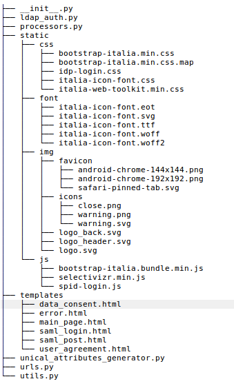

Customize uniAuth
^^^^^^^^^^^^^^^^^

In the projects tree there's an application called `idp`, in it we configured the customization of some AttributeProcessors, the AuthenticationBackend based on LDAP and the template to use.
Use it as an example to do your customizations, you can even create another Authentication backend or your customized Attribute Processors in your applications.

For example if you have to change the `Organization logo` you can simply create a new app with custom ``static/`` images, styles and js.

Remember also to put your brand new application in ``django_idp.settingslocal.INSTALLED_APPS``, in case of a custom Authentication Backend put it in ``django_idp.settings.AUTHENTICATION_BACKENDS``.

  This is the structure of `idp`

Localization i18n
^^^^^^^^^^^^^^^^^

It relies to `Django documentation <https://docs.djangoproject.com/en/2.2/ref/django-admin/#django-admin-makemessages>`__.

You'll find gettext .po files into ``locale/`` folder, then you can translate messages before compiling them with:

::

    ./manage.py compilemessage
